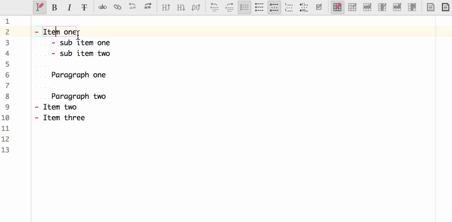
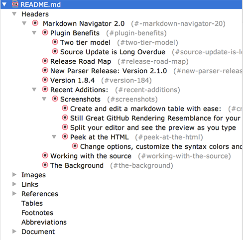
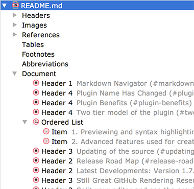
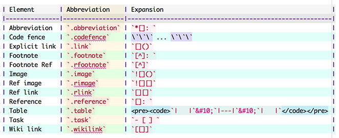
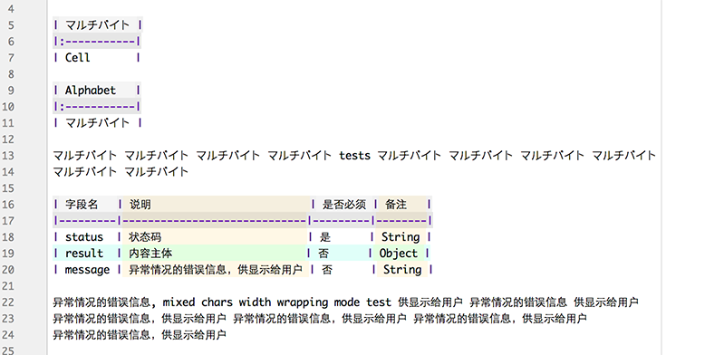
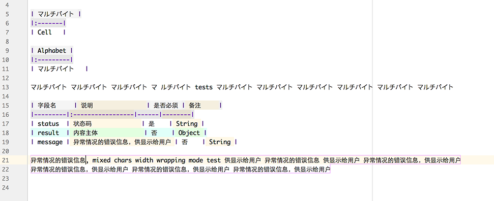
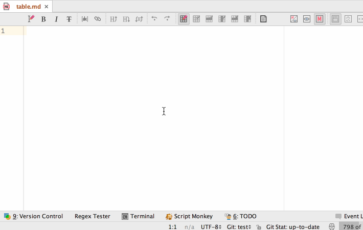

Markdown Navigator
==================

Markdown Navigator plugin provides **[Markdown] language support for [IntelliJ IDEA],
[RubyMine], [PhpStorm], [WebStorm], [PyCharm], [AppCode], [Android Studio], [CLion] and
[DataGrip].**

**You can download it on the [JetBrains plugin page].**

[TOC levels=2,3]: #### "Table of Contents"
#### Table of Contents
- [Plugin Name Has Changed](#plugin-name-has-changed)
- [General Information](#general-information)
    - [Plugin Benefits](#plugin-benefits)
- [Release Road Map](#release-road-map)
- [Latest Developments: Upcoming release of Version 1.8.0](#latest-developments-upcoming-release-of-version-180)
- [Version 1.7.1](#version-171)
- [Version 1.7.0](#version-170)
    - [Still Great GitHub Rendering Resemblance for your preview pleasure](#still-great-github-rendering-resemblance-for-your-preview-pleasure)
    - [Split your editor and see the preview as you type](#split-your-editor-and-see-the-preview-as-you-type)
    - [Peek at the HTML](#peek-at-the-html)
- [Working with the source](#working-with-the-source)
- [The Background](#the-background)

***

## Plugin Name Has Changed

The plugin name was changed to avoid name infringement on [Fletcher T. Penney's MultiMarkdown]
project. The plugin id used for updates has not changed but the displayed name has changed from
**idea-multimarkdown** and **MultiMarkdown** to **Markdown Navigator**. Additionally, the
language supported by the plugin was changed to **[Markdown]** from **MultiMarkdown**. For
details see
[Settings Affected by Plugin Name Change](../../wiki/Settings-Affected-by-Plugin-Name-Change)

## General Information

### Plugin Benefits

This plugin generates a preview that it is as close as possible to how the page will look on
GitHub but do it with more IntelliJ environment intelligence to make editing and maintaining
markdown documents easier. Developing with pleasure is only half the job. Real projects need to
be documented. This plugin wants to extend the pleasure principle to the inevitable
documentation part of the project.

GitHub may recognize variants of Markdown syntax that this plugin will not and vice versa. This
is due to the parser differences and the fact that GitHub has a few syntax modifications that
conflict with original Markdown spec. This plugin uses [pegdown] library by [sirthias] with a
few extensions added to make the rendering of GFM more faithful.

The plugin also includes some syntax extensions from [Fletcher T. Penney's MultiMarkdown]
project.

#### Two tier model of the plugin

1. Previewing and syntax highlighting functionality is available in the Basic open source
   edition. Intended for mostly previewing markdown documents. Wiki link refactoring and
   completions are also available in the basic edition to ease the task of wiki maintenance.

2. Advanced features used for creating and maintaining markdown documents such as split editor,
   refactoring, find usages, validation, auto formatting and HTML page customizations are only
   available in the Enhanced licensed version. 30-day free trial licenses are available from
   [idea-multimarkdown] page on my website.

       

#### Updating of the source  

There was much code churn in the enhanced version and I have not had time to merge them into the
open source version. Initially when most of the differences were limited to a few files it easy
to keep them separated and sync the rest. Now, with major preferences and settings re-work,
directory layout changes and new features, the differences have spread out where keeping them in
sync is a major effort. I started factoring out the enhanced only changes to separate files so
that future synchronization of the two branches can be less time consuming.

I am part way through the task but the formatting wound up being much more intricate than I
imagined and it is not leaving me much time to make updates to latest version.

Release Road Map
----------------

Current implementation using [pegdown][] as the parser, which has caused many of the performance
and IDE hanging issues, resulting in many complaints about the plugin degrading IDE performance.
Reason for the choice is detailed in:

I am changing the [Markdown] parser used by the plugin from [pegdown] to [flexmark-java], a fork
from [commonmark-java].
[Pegdown - Achilles heel of the Markdown Navigator plugin](http://vladsch.com/blog/15).

[commonmark-java] is intended for HTML generation and lacks markdown elements in its AST,
keeping only those needed for generating the HTML. It does not have source position tracking for
its inline elements assumes assumes that extension will add to the parser and not change the
basic behavior of the parser, which in the case of a parser for this plugin does not hold true.

To overcome these limitations I forked the project and created the needed modifications,
allowing extensions to change every aspect of the parser. The [flexmark-java] project is in its
early development stage. All the commonmark spec tests have been converted to include testing
the generated AST and are passing. All extensions have been converted along with their tests to
use the spec.txt format with AST validation and are also passing.

In the process of adding source tracking the performance was impacted by about 25-35%, which
still makes it about **10x** faster on large files than [intellij-markdown] parser used by
[Markdown Support] and about **30x-50x** faster than pegdown. All that without the exponential
parse time edge cases or the infinite loop parsing on some sources.

I am now in the process of adding all the necessary extensions to make the new parser be able to
replace pegdown in the plugin.

A few days were sacrificed to hack some features into Markdown Navigator to help with creating
and navigating the common mark spec format file and generating flexmark-java extensions. Just
could not live without basic auto completions, go to declaration and some error highlighting.

Latest Developments: Upcoming release of Version 1.8.0
------------------------------------------------------

For a full list see the [Version Notes]

- **Table of Contents** tag that works with basic markdown syntax and is updated by the plugin.
  The table of contents at the top of this page is an example. For more information see the
  [wiki](../../wiki/Adding-a-Table-of-Contents)

- Java class, method, field completions in inline code. Great if you need to reference code
  elements in your project from a markdown document.

Version 1.7.1
-------------

- New toolbar buttons and actions:
    - Double/Single space list
    - Toggle task item done status on/off
    - Change list item or items in selection to:
        - Bullet items
        - Numbered items
        - Task items

        If the selection does not contain any list items and only paragraphs then the paragraphs
        will be changed to respective list items

        If all the list items in selection are already of respective type then they will be
        changed to plain text paragraphs, except for task list items. These will revert to
        bullet list items.

    

- Fix #247, Error and corrupting files, duplicates #248, #249, #250 and #251
- Fix: #244, NPE upon opening simple markdown file
- Fix: scratch files not recognized as Markdown during editor creation in latest
  intellij-community builds.
- Fix: #245, Inserting an ordered list item on ENTER with renumbering enabled causes exception
- Fix: #246, Auto scroll to source. Swing preview would always scroll to top of page after
  document modification.
- Add: preview setting for `Scroll preview to source position` for Swing preview.

Version 1.7.0
-------------

- **Document Structure View** added with sections for:

    - Headers to show header hierarchy by level  
      
    - Images with all images in the document
    - References with all references in the document
    - Tables with all tables in the document
    - Abbreviations with all abbreviations in the document
    - Footnotes with all Footnotes in the document
    - Document showing all abbreviations, block quotes, footnotes, headers, images, lists,
      references and tables in the document in the hierarchy and order of their location in the
      document.  
      

- **Document format** toolbar button and action to format the document to code style settings.
  [Document Format Options](../../wiki/Document-Format-Options)

- Dynamically created syntax highlighting attributes to simulate overlay of element style with
  transparency. This creates consistent colors when multiple attributes are combined, such as
  inline elements in tables, headers and definition terms.  
  

- Actual character display font width used for wrapping and table formatting, allowing best
  alignment for multi-byte characters and proportional fonts:

    With character width taken into account:  
    

    Assuming fixed character width:  
    

- **Block Quote** increase/decrease level toolbar buttons and actions.

- **Emoji** support added to preview.

- Toolbar, Live Template and Table editing improved. See
  [Enhanced Features](../../wiki/Enhanced-Features).

You can create and edit a markdown table with ease:

### Still Great GitHub Rendering Resemblance for your preview pleasure

### Split your editor and see the preview as you type

### Peek at the HTML

#### Change options, customize the syntax colors and CSS to your liking.

Working with the source
-----------------------

This plugin is using a modified version of [sirthias], I post my PR's but there is always a
delay in both generating them and for them to be merged. Additionally, some changes are specific
to this plugin and have no wide appeal.

The pegdown source used in this plugin can be found [vsch/pegdown].

The Background
--------------

It all started with a desire to see Markdown files in PhpStorm IDE as they would look on GitHub.
I was already using [nicoulaj/idea-markdown plugin] but found its preview was more like
[Craig's List] than [GitHub]. It did not appear to have been recently updated, so I decided to
fork it and modify the style sheet it uses. How hard could that be?

I found out quickly that there was more to it than meets the eye. Rendering is done by Java not
a browser, the parser is HTML 3.1 and not all features are implemented. Additionally, the Table
extension did not work in the version of `pegdown` used by the plugin. I needed that because
maintaining HTML tables is a pain. So I upgraded the plugin to use the latest `pegdown`,
`parboiled` and fixed a few bugs. Since I was already in the code, I might as well add a few
more desired features like user editable style sheet, fix a few more bugs, add updates to
preview so that I could split the editor pane and edit in one while seeing the preview in the
other.

Then I encountered some bugs in parsing of compound nested lists in `pegdown` and had to dive
into its source to fix them. Having done that and gotten familiar with it, I decided to add a
new extension. Finally, to help me with debugging and generating test expectations for
`pegdown`, I had to have the HTML Text tab to display the generated HTML.

It has been a fun trip down the rabbit hole of IntelliJ IDEA plugin development that started
with a simple desire for a Markdown preview that looked like GitHub's.

---

\* This plugin is based on the [nicoulaj/idea-markdown plugin] by [nicoulaj], which is based on
[pegdown] library by [sirthias].

Markdown Navigator, Copyright (c) 2016, V. Schneider,  
<http://vladsch.com> All Rights Reserved.

[.gitignore]: http://hsz.mobi
[Android Studio]: http://developer.android.com/sdk/installing/studio.html
[AppCode]: http://www.jetbrains.com/objc
[CLion]: https://www.jetbrains.com/clion
[Craig's List]: http://montreal.en.craigslist.ca/
[DataGrip]: https://www.jetbrains.com/datagrip
[GitHub Issues page]: ../../issues
[GitHub]: https://github.com/vsch/laravel-translation-manager
[idea-multimarkdown]: http://vladsch.com/product/multimarkdown
[IntelliJ IDEA]: http://www.jetbrains.com/idea
[JetBrains plugin comment and rate page]: https://plugins.jetbrains.com/plugin/writeComment?pr=&pluginId=7896
[JetBrains plugin page]: https://plugins.jetbrains.com/plugin?pr=&pluginId=7896
[Markdown]: http://daringfireball.net/projects/markdown
[Markdown Support]: https://plugins.jetbrains.com/plugin/7793?pr=
[nicoulaj/idea-markdown plugin]: https://github.com/nicoulaj/idea-markdown
[nicoulaj]: https://github.com/nicoulaj
[pegdown]: http://pegdown.org
[PhpStorm]: http://www.jetbrains.com/phpstorm
[Pipe Table Formatter]: https://github.com/anton-dev-ua/PipeTableFormatter
[PyCharm]: http://www.jetbrains.com/pycharm
[RubyMine]: http://www.jetbrains.com/ruby
[sirthias]: https://github.com/sirthias
[Version Notes]: resources/META-INF/VERSION.md
[vsch/pegdown]: https://github.com/vsch/pegdown/tree/develop
[WebStorm]: http://www.jetbrains.com/webstorm
[Wiki]: ../../wiki
[GitHub wiki in IntelliJ IDE]: ../../wiki/Adding-GitHub-Wiki-to-IntelliJ-Project
[Kotlin]: http://kotlinlang.org
[intellij-markdown]: https://github.com/valich/intellij-markdown 
[commonmark-java]: https://github.com/atlassian/commonmark-java
[Fletcher T. Penney's MultiMarkdown]: http://fletcherpenney.net/multimarkdown/
[flexmark-java]: https://github.com/vsch/flexmark-java

