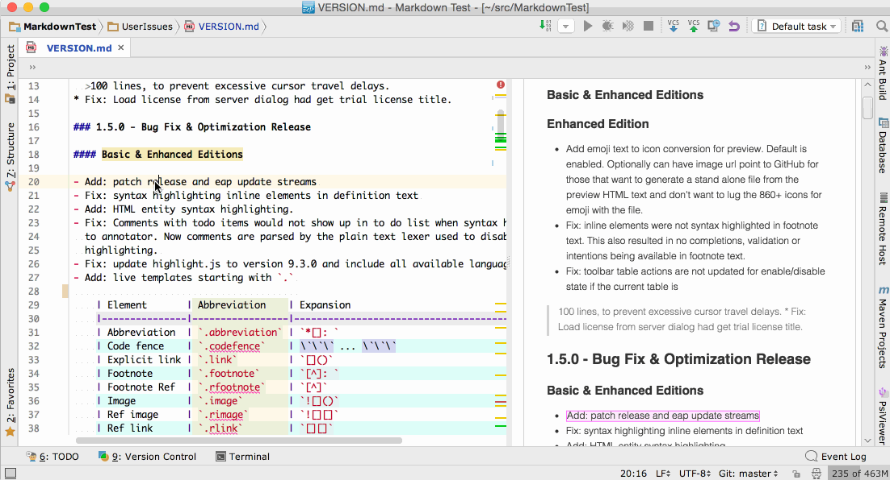

 Markdown Navigator
========================================================================================================

Markdown Navigator plugin provides **[Markdown] language support for [IntelliJ IDEA],
[RubyMine], [PhpStorm], [WebStorm], [PyCharm], [AppCode], [Android Studio], [CLion] and
[DataGrip].**

**You can download it on the [JetBrains plugin page].**

[TOC levels=2,3]: # "Table of Contents"

### Table of Contents
- [Plugin Benefits](#plugin-benefits)
    - [Two tier model](#two-tier-model)
    - [Source Update is Long Overdue](#source-update-is-long-overdue)
- [Release Road Map](#release-road-map)
- [New Parser Release: Version 2.0.0](#new-parser-release-version-200)
- [Version 1.8.4](#version-184)
- [Recent Additions:](#recent-additions)
    - [Screenshots](#screenshots)
- [Working with the source](#working-with-the-source)
- [The Background](#the-background)

***

## Plugin Benefits

This plugin generates a preview that is as close as possible to how the page will look on GitHub
but do it with more IntelliJ IDE intelligence to make editing and maintaining markdown documents
easier. Developing with pleasure is only half the job. Real projects need to be documented. This
plugin extends the pleasure principle to the inevitable documentation part of the project.

The parser and rendering differences are greatly reduced by the new parser which offers a lot of
flexibility in tweaking parsing rules to allow better emulation of other markdown parsers.

The plugin includes some syntax extensions from [Fletcher T. Penney's MultiMarkdown] project
which are not supported by GFM.

### Two tier model

1. Previewing and syntax highlighting functionality is available in the Basic open source
   edition. Intended for mostly previewing markdown documents and unaided editing. Wiki link
   refactoring and completions are also available in the basic edition to ease the task of wiki
   maintenance.

2. Advanced features used for creating and maintaining markdown documents with a split editor,
   refactoring, find usages, validation, auto formatting and HTML page customizations are only
   available in the Enhanced licensed version. 15-day free trial licenses are available from
   [idea-multimarkdown] page on my website.

### Source Update is Long Overdue

There was much code churn in the enhanced version and I have not had time to merge them into the
open source version. Initially, most of the differences were limited to a few files making it
easy to keep them separated and sync the rest. Now, with major preferences and settings re-work,
directory layout changes and new features, the differences have spread out where keeping them in
sync is a major effort. I started factoring out the enhanced only changes to separate files so
that future synchronization of the two branches can be less time consuming.

I will address the open source release after version 2.0 release of the plugin. I only want to
go through the effort of merging these major differences once.

Release Road Map
----------------

The [Markdown] parser used by the plugin has changed from [pegdown] to [flexmark-java].

[flexmark-java] is my fork of [commonmark-java], with the following changes:

- source element based AST with detailed break down of each element for syntax highlighting 
- complete source position tracking for all elements and their lexical parts
- optimized for efficient parsing with many parser extensions installed
- unified core and extension options API to simplify parser/renderer configuration
- options to tweak core parser rules

In the process of making the needed modifications to the original [commonmark-java] parser,
performance was impacted by about 25-35%. This still makes the new parser **7x-10x** faster than
[intellij-markdown] parser used by [Markdown Support] and **25x-50x** faster than pegdown. As an
added benefit, the new parser does not suffer from pegdown's idiosyncrasies of exponential parse
times or pathological input cases that cause infinite loops in the parser's state machine.

On the coding end, the new parser is a joy to maintain and enhance. The parser architecture,
inherited from [commonmark-java], is easy to debug and test. Markdown element parsers have
little or no interdependencies with other element parsers making it easy to fine tune parser
behaviour on a per element basis and add parser configuration options to emulate other markdown
processors. All this is in contrast to pegdown's one big PEG grammar implementation with
everything potentially inter-dependent.

New Parser Release: Version 2.0.0
---------------------------------

All parsing and rendering is now done by the new parser. Performance and typing response is
simply amazing. For small files, about 100k and less than a thousand lines, you can set the
syntax highlighter to "Lexer". For larger files or when you want fastest typing response, then
syntax highlighter should be set to "Annotator", which is the default. For best typing response
in very large files, you can turn off the preview while editing.

For a full list of changes see the [Version Notes]

- Add: GFM table rendering option to render tables text that GFM would render as text.
- Add: JavaFX preview scroll to source position
- Add: JavaFX highlight preview element at caret position, with detail down to source line
- Add: flexmark parser for all parsing and rendering.
- Some elements still missing but they are not supported by GFM:
    * Definitions
    * Typographic: Quotes, Smarts
    * Multi-Line Image URLs
- Add: Languages & Settings > Markdown > Debug settings for which parser is to be used for:
  lexer, parser, annotator and HTML renderer. Highly recommended these are all set to "flexmark"
  but if you want to compare or need pegdown parsing then set them to how it used to be, set one
  or all to pegdown.

    :warning: Pegdown version is no longer supported so you are on your own for any issues and
    problems caused by using pegdown parser. :smiling_imp: I couldn't wait to be able to say
    that.

Version 1.8.4
-------------

:warning: This is the last release using [pegdown] and compatible with JRE 1.6. Later releases
are based on the [flexmark-java] and require JRE 1.8.

- Project module names added to inline code completions

- More flexible inline code completions, will allow qualified class names and multi-class name
  matches when completing members. If more than one class name matches then the combined set of
  members is used from all matched classes.

- Inline code elements are now treated as literal so that classes, methods and fields can be
  refactored with search in strings.

    :warning: this only works if syntax highlighting is set to lexer not annotator. Lexer used
    when annotator syntax highlighting is selected only distinguishes html comments from plain
    text. The comments are needed to allow for TODO processing to work with either highlighter.

Recent Additions:
-----------------

- JavaFX preview scroll to source with highlight element in preview

    
    
- **Table of Contents** tag that works with basic markdown syntax and is updated by the plugin.
  The table of contents at the top of this page is an example. For more information see the
  [wiki](../../wiki/Adding-a-Table-of-Contents)

- Java class, method and field completions in inline code. Great if you need to reference code
  elements in your project from a markdown document.

- toolbar buttons and actions, see [Enhanced Features](../../wiki/Enhanced-Features)

    

- **Document Structure View** with sections for:
    - Headers to show header hierarchy by level  
      
    - Images
    - References
    - Tables
    - Abbreviations
    - Footnotes
    - Document section showing all abbreviations, block quotes, footnotes, headers, images,
      lists, references and tables in the document. According to markdown element hierarchy and
      in order of their location in the document.  
      

- **Document format** toolbar button and action to format the document to code style settings.
  [Document Format Options](../../wiki/Document-Format-Options)

- Dynamically created syntax highlighting attributes to simulate overlay of element style with
  transparency. This creates consistent colors when multiple attributes are combined, such as
  inline elements in tables, headers and definition terms. Additionally allows for bold, italic,
  and effect type and color to be combined for nested markdown inline elements.
  

- Actual character display font width can be used for wrapping and table formatting, allowing
  best alignment for multi-byte characters and proportional fonts:

    With character width taken into account:
    

    Without taking character width into account:
    

- **Block Quote** increase/decrease level toolbar buttons and actions.

- **Emoji** support added to preview.

- Toolbar, Live Template and Table editing improved. See
  [Enhanced Features](../../wiki/Enhanced-Features).

### Screenshots

##### Create and edit a markdown table with ease:

##### Still Great GitHub Rendering Resemblance for your preview pleasure

##### Split your editor and see the preview as you type

##### Peek at the HTML

###### Change options, customize the syntax colors and CSS to your liking.

Working with the source
-----------------------

This plugin is using a modified version of [sirthias/pegdown], I post my PR's but there is
always a delay in both generating them and for them to be merged. Additionally, some changes are
specific to this plugin and have no wide appeal.

The pegdown source used in this plugin can be found [vsch/pegdown].

The Background
--------------

It all started with a desire to see Markdown files in PhpStorm IDE as they would look on GitHub.
I was already using [nicoulaj/idea-markdown plugin] but found its preview was more like
[Craig's List] than [GitHub]. It did not appear to have been recently updated, so I decided to
fork it and modify the style sheet it uses. How hard could that be?

I found out quickly that there was more to it than meets the eye. Rendering is done by Java not
a browser, the parser is HTML 3.1 and not all features are implemented. Additionally, the Table
extension did not work in the version of `pegdown` used by the plugin. I needed that because
maintaining HTML tables is a pain. So I upgraded the plugin to use the latest `pegdown`,
`parboiled` and fixed a few bugs. Since I was already in the code, I might as well add a few
more desired features like user editable style sheet, fix a few more bugs, add updates to
preview so that I could split the editor pane and edit in one while seeing the preview in the
other.

Then I encountered some bugs in parsing of compound nested lists in `pegdown` and had to dive
into its source to fix them. Having done that and gotten familiar with it, I decided to add a
new extension. Finally, to help me with debugging and generating test expectations for
`pegdown`, I had to have the HTML Text tab to display the generated HTML.

It has been a fun trip down the rabbit hole of IntelliJ IDEA plugin development that started
with a simple desire for a Markdown preview that looked like GitHub's.

---

\* This plugin is based on the [nicoulaj/idea-markdown plugin] by [nicoulaj], which is based on
[pegdown] library by [sirthias].

Markdown Navigator, Copyright (c) 2016, V. Schneider, <http://vladsch.com> All Rights Reserved.

[Android Studio]: http://developer.android.com/sdk/installing/studio.html
[AppCode]: http://www.jetbrains.com/objc
[CLion]: https://www.jetbrains.com/clion
[Craig's List]: http://montreal.en.craigslist.ca/
[DataGrip]: https://www.jetbrains.com/datagrip
[Fletcher T. Penney's MultiMarkdown]: http://fletcherpenney.net/multimarkdown/
[GitHub]: https://github.com/vsch/laravel-translation-manager
[IntelliJ IDEA]: http://www.jetbrains.com/idea
[JetBrains plugin page]: https://plugins.jetbrains.com/plugin?pr=&pluginId=7896
[Markdown]: http://daringfireball.net/projects/markdown
[Markdown Support]: https://plugins.jetbrains.com/plugin/7793?pr=
[PhpStorm]: http://www.jetbrains.com/phpstorm
[PyCharm]: http://www.jetbrains.com/pycharm
[RubyMine]: http://www.jetbrains.com/ruby
[Version Notes]: resources/META-INF/VERSION.md
[WebStorm]: http://www.jetbrains.com/webstorm
[commonmark-java]: https://github.com/atlassian/commonmark-java
[flexmark-java]: https://github.com/vsch/flexmark-java
[idea-multimarkdown]: http://vladsch.com/product/multimarkdown
[intellij-markdown]: https://github.com/valich/intellij-markdown
[nicoulaj]: https://github.com/nicoulaj
[nicoulaj/idea-markdown plugin]: https://github.com/nicoulaj/idea-markdown
[pegdown]: http://pegdown.org
[sirthias]: https://github.com/sirthias
[sirthias/pegdown]: https://github.com/sirthias/pegdown
[vsch/pegdown]: https://github.com/vsch/pegdown/tree/develop
[.gitignore]: http://hsz.mobi
[GitHub Issues page]: ../../issues
[GitHub wiki in IntelliJ IDE]: ../../wiki/Adding-GitHub-Wiki-to-IntelliJ-Project
[JetBrains plugin comment and rate page]: https://plugins.jetbrains.com/plugin/writeComment?pr=&pluginId=7896
[Kotlin]: http://kotlinlang.org
[Pipe Table Formatter]: https://github.com/anton-dev-ua/PipeTableFormatter
[Wiki]: ../../wiki

