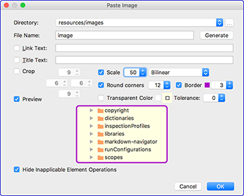

## Markdown Navigator

[TOC levels=3,6]: # "Version History"

### Version History
- [2.3.4.9  - Bug Fix & Enhancement Release](#2349----bug-fix--enhancement-release)
- [2.3.4 - Bug Fix & Enhancement Release](#234---bug-fix--enhancement-release)
- [2.3.3 - Bug Fix & Enhancement Release](#233---bug-fix--enhancement-release)
- [2.3.2 - Compatibility & Bug Fix Release](#232---compatibility--bug-fix-release)
- [2.3.1 - Compatibility & Enhancement Release](#231---compatibility--enhancement-release)
- [2.3.0 - Compatibility & Enhancement Release](#230---compatibility--enhancement-release)
- [2.2.0 - Compatibility & Enhancement Release](#220---compatibility--enhancement-release)
- [2.1.1 - Bug Fix & Enhancement Release](#211---bug-fix--enhancement-release)
- [2.1.0 - Bug Fix Release](#210---bug-fix-release)
- [2.0.0 - New Parser Release](#200---new-parser-release)

&nbsp;

**To Do List**

##### To Do

* [ ] Add: when typing in the text field for change link to reference, automatically enable the
      add reference text if reference id is different from original
* [ ] Add: transpose table, best to add `copy to clipboard transposed table`
* [ ] Add: join processor to remove bullet list marker when joining next line item
* [ ] Fix: cursor navigation very slow in table with few rows but very long text in columns: see
      `Extensions.md` in `flexmark-java` wiki. Suspect is figuring out table context for toolbar
      button state update.
* [ ] Fix: When pasting text that contains ref links over a selection that already has these
      references, after the paste the references are deleted but new ones are not added. Put a
      check if possible to ignore any existing references in a selection since they will be
      deleted by the paste.
* [ ] Fix: can't modify PSI inside on save listener.
* [ ] Add: GitHub links should offer the same change relative/http: intention as the rest of the
      links.
* [ ] Fix: Link Map
      * [ ] implement `ExpandedItemRendererComponentWrapper` for table cells so that the
            extended tooltip does not hide an error tooltip.
* [ ] Add: ability to move a lookup-up to the start of an element's location so that completions
      for emoji shortcuts and links located in heading elements can be properly aligned.
* [ ] Fix: take a look at the toolbar implementation to see if it can be made to put in a drop
      down for buttons that don't fit.
* [ ] Add: source synchronization for Swing preview window
* [ ] Add: source synchronization for HTML plain text previews
* [ ] Add: detection for **GitHub** issue completions when no task servers are defined.
* Add: transpose table, best to add `copy to clipboard transposed table`

&nbsp;

### 2.3.4.9  - Bug Fix & Enhancement Release

* Fix: absolute `http://..../wiki` link to wiki home page would to resolve as a file reference.
* Fix: drag/drop wiki page files would ignore link address format and always insert page
  relative link.
* Fix: style auto wrapping when caret at end of word that is at end of file without trailing EOL. 
* Add: future API for drag/drop handling code to eliminate the need for replacing editor
  drag/drop handler.
* Add: highlight selection in preview, `Show source selection in preview` enabled by default.
  Wraps selection in `` with `selection-highlight` class.
* Add: #399, Highlight search results in preview, `Show source search highlights in preview`
  enabled by default. Wraps highlights in `` with `search-highlight` class.
* Fix: text drag/drop not working because of MarkdownPasteHandler
* Add: option to enable drag/drop handler replacement to allow "Copy" extended file drag/drop
  action at the expense of text drag/drop. Disabled by default in settings `Languages &
  Frameworks > Markdown`
* Fix: loosen/tighten list action to not mark a list as loose when blank line precedes the first
  list item.
* Fix: #404, Conversion from CommonMark or FixedIndent to GitHub does not properly indent code
  blocks in list items
* Fix: #403, Indented code in list items not indented enough with GitHub list parser option
* Change: link color in Preview and Editor Colors to match new GitHub colors
* Fix: #400, Better code color consistency needed. Now same as Fenced Code/Verbatim. Also change
  copy Markdown as HTML formatted text and PDF export to align inline code color with indented
  and fenced code.
* Fix: #398, Poor alignment between source and preview when using "Sync source to preview". Now
  there is an option to vertically align synchronized position in Preview Settings, selected by
  default.
* Fix: #402, PDF Export action fails silently if no text is selected in document instead of
  exporting the full document.

### 2.3.4 - Bug Fix & Enhancement Release

* Fix: incorrect parsing in GitHub Doc compatibility mode, #401, Parser fails if code chunks
  contain markdown header elements
* Add: Link Format option to `Paste Image` and `Copy Image` dialogs
  * Page Relative
  * Repo Relative (`/...`)
  * Absolute (`http://`)
  * Absolute (`file://`)

  
* Add: Link Format option to drag & drop non-image files if copy dragging (Ctrl on
  Linux/Windows, ⌥ on OS X) dialog is presented before the first file link is created and the
  same format is used for the rest of the files.
* Add: File drag and drop into markdown document to create links, image files create image links
  the rest create inline links. Each file link will be added as a separately undoable command.

  If copy dragging images (Ctrl on Linux/Windows, ⌥ on OS X) then for image files the `Copy
  Image` dialog will open (like paste image) that will allow you to modify the image and choose
  the location where to store the copy.
* Fix: #394, NullPointerException in MarkdownPasteHandler.doExecute()
* Fix: references to images in the project from wiki home page with `file://`, `http://` or
  `https://` format would show as unresolved and conversion. Also affected conversion of link
  format on wiki home page.

### 2.3.3 - Bug Fix & Enhancement Release

* Add: change mouse cursor to cross hairs when over preview image in paste image dialog
* Add: outline to center pixel zoomed in image
* Add: cropping options to paste image dialog
* Add: color selection with tolerance to make transparent
* Fix: change directory history for paste image dialog to display project directories without
  project base path prefix and store them as system independent.
* Fix: image link not correct when pasting image in non-wiki document with actual image file is
  put in wiki
* Add: image scaling with interpolation type to paste image dialog
* Add: paste of images directly into markdown files as image links. Pasting with a caret on an
  existing image link will set the defaults in the paste image dialog from the link.
  Functionality implemented thanks image utils library from [holgerbrandl/pasteimages].
* Fix: #390, `Copy Markdown as HTML formatted` action is disabled unless there is a selection in
  the document.
* Fix: #389, Null Pointer Exception on in toolbar disabled button handling.
* Add: suggestion for file rename refactoring replacing spaces with dashes
* Fix: convert link format intention would be disabled for some image links
* Add: pdf export customizable profile, defaults to `COPY_HTML_MIME`
* Add: pdf export font family drop down for built in fonts
* Fix: toggle style would not wrap the previous word if caret at end of document without a
  terminating EOL.
* Add: max image width and default font family settings for use by Copy Markdown to HTML
  formatted and Export to PDF actions
* Add: img style `max-width:100%` to HTML mime copy and `max-width:504pt` PDF export to scale
  images instead of clipping them.
* Add: JavaFX WebView state persistence through `window.__MarkdownNavigator.getState("name")`
  and `window.__MarkdownNavigator.setState("name", value)`
* Add: #388, JavaFX script for GitHub Collapse Markdown script use state persistence for
  initializing the open/close state of headings. Now collapsed heading are preserved between
  page refreshes and when opening markdown files.
* Fix: paragraph spacing in `html_mime_default.css`
* Add: PDF export action, menu and toolbar item
* Fix: highlight on scroll to only exclude typing and backspace edit actions if Highlight on
  edit is disabled.
* Fix: Swing preview paragraphs not missing inter-paragraph spacing
* Fix: add parser option to turn off GFM treatment of list item as loose if blank line follows
  item paragraph. This is incompatible with GitHub rendering but gives better control of when an
  item is loose.

### 2.3.2 - Compatibility & Bug Fix Release

* Add: #385, toolbar button tooltips to show reason for button being disabled.
* Fix: #384, Add block quote level on ATX heading looses the heading prefix
* Fix: Markdown list indentation format conversion would loose blank lines.
* Fix: HTML to Markdown intention would only take the opening inline HTML tag
* Fix: #383, Absolute `http://` links to wiki pages do not resolve to files
* Fix: #382, JavaFX Preview is using project settings for Zoom and Grey Scale Antialiasing
  instead of scoped rendering profile
* Fix: update to flexmark-java 0.14.0 with typographic quotes and smarts conversion
* Fix: #379, HTML block content indent doubling on document format
* Fix: #378, Leading spaces on reference definition after the first would cause the reference to
  be processed as text.
* Fix: copy markdown as html to use the current file's rendering profile as the parent for
  COPY_HTML_MIME so that any settings not marked as overriding project settings will be as per
  rendering profile for the file.
* Fix: typing a character right after a list item marker would sometimes insert a space after
  the character.
* Change: #380, Sorting of non-rendering elements should not be case sensitive
* Add: annotation and quick fix for GitHub Doc parsing issue of `- [ ] [reference]` being
  interpreted as `- [ ][reference]` which is a list item with a link reference with explicit
  link text of a space.
* Add: #377, Add Format conversion between list indentation types for files.
* Fix: #376, HTML to Markdown converter does not handle pre tags with inner span tags. HTML to
  Markdown to properly handle conversion to fenced code when HTML consists of `<pre>` and
  content is ``'s with color and highlighting information.

### 2.3.1 - Compatibility & Enhancement Release

* Fix: #374, EAP Plugin version Find Usages related functionality generates exception in 2016.3
  and prior
* Change: inline code completion for Java now second invocation does simple completion and third
  does fully qualified names.
* Add: toolbar button for underline, subscript, superscript
* Update: emoji shortcuts and icons to latest Emoji Cheat Sheet version and refactor code to use
  flexmark-java emoji extension data.
* Add: Automatic mime `text/html` conversion to markdown on paste in Markdown documents.
* Add: Markdown To Html intention action to convert some markdown elements like:
  * Tables
  * Image Links
  * Definition Lists
* Add: Html to Markdown intention action to convert html blocks to Markdown
* Fix: `NoClassDefFoundError` when running in PhpStorm for flexmark-java-plugin code
* Fix: toc refactoring was not reflecting raw title string
* Add: annotation and quick fix for TOC with empty title string. GitHub does not accept this so
  an empty title needs at least one space in the title string of the TOC element.
* Add: adding markdown referenceable elements such as footnotes, references and headings from
  files included through Jekyll include tags
* Add: Jekyll include tag parsing and processing the include, if markdown will be parsed to HTML
  and rendered in the view, if not markdown will be included in the HTML
* Add: flexmark-java Inline Parser Extension option to module defaults
* Fix: #365, PhpStorm - Highlight preview element settings does not persist between sessions
* Fix: enable emoji completions if completions are invoked after a single `:` with the caret
  right after the colon or without spaces or tabs between colon and caret position.
* Fix: enable GitHub issue completion when completion invoked with only digits between caret and
  preceding #.
* Fix: #363, Markdown aware trailing space stripping is not working in 2017.1 EAP
* Fix: #362, Java exception in version 2.3.0 with Pycharm 2016.1.5
* Fix: #361, HTML Export "CSS dir" and "script dir" not saved
* Fix: #360, Auto-formatting creates list by accident, added two code style settings for text
  wrapping options for `Special Characters` which are `*+-:~>#` and digits followed by `.` or
  `)` for CommonMark, enabled by default:
  * `Escape when wrapped to start of line`
  * `Unescape when wrapped away from start of line`
* Fix: #358, "Unresolved link reference" errors for `gh-pages` and `releases` where branch is
  expected. Now only `blob/` and `raw/` are attempted to be resolved, the rest are treated as
  external unchecked links.
* Fix: HTML export was not working on Windows due to missed system dependent/independent
  conversions.
* Fix: #359, "Reformat Document" inflates files with link references, footnotes would double
  their text content output
* Fix: "Jekyll front matter" inspection to force re-parse of files after parser option is
  enabled.
* Add: `PARSE_JEKYLL_MACROS_IN_URLS` option for parser when Jekyll Front matter parsing is
  enabled to allow parsing of jekyll macros in urls with spaces between braces.
* Fix: fenced code that is adjusted for indentation should keep content indent relative to other
  content unchanged.
* Fix: sub-list after a paragraph needs a blank line, it should not be considered a loose list.

### 2.3.0 - Compatibility & Enhancement Release

* Add: annotation and quick fix when an empty list item needs a space after item marker.
* Add: annotation and quick fixes when possible list items are found in paragraphs and indented
  code when list indentation rules are set to CommonMark or GitHub because incorrect
  indentation.
* Fix: fenced code and indented code would loose indentation prefix when formatting document
* Fix: list items whose first element is a heading, indented code or fenced code now add a line
  break when parser compatibility set to other than CommonMark to allow GitHub to properly
  process these list items.
* Add: Code Style option for spaces after definition item marker, default 3 for greater
  compatibility with various markdown processors.
* Add: Code Style option to insert a blank line before a list item if it is not preceded by
  another list item, disabled by default and formatting a document will create maximum
  compatibility with markdown processors that limit list item interpretation when not preceded
  by a blank line. When disabled formatting a document may still add a blank line before a list
  if the current list processing type requires a blank line before a list.
* Add: Annotation and quick fix if first list item needs to have a blank line before it to be
  properly parsed as a list. List indentation type dependent and for CommonMark list item type
  and numeric sequence dependent.
* Fix: #349, Show version number on plugin configuration screen, moved version number. Now more
  prominently displayed at the top of the main panel next to update channel selection.
* Fix: #348, IDE error when switching to Default JavaFX Stylesheet, added a validation for
  browser/stylesheet combinations so that invalid restored editor state would be corrected.
* Fix: #347, Stops rendering on PHPStorm, added a validation for split editor setting and
  preview type so that if restored editor setting is not editor only and preview set to NONE
  then preview will be changed to PREVIEW.
* Fix: #352, Files without suffix are not resolved in links, also show them in completion. These
  files are assumed to be Text files
* Add: Parser extensions:
  * Inserted: `++inserted text++` results in underlined text
  * Subscript: `~subscript~`
  * Superscript: `^superscript^`
* Add: Actions to navigate table cells: next/prev table cell with and without selection to stop
  at beginning/end of cell and start/end of table row
* Fix: List syntax dependent list item action behavior.
  * Fix: indent/un-indent for other than fixed 4 has to re-indent child items to the parent's
    new indent level. Otherwise parsing of the children will be off. Right now works only for
    fixed4
  * Add: flexmark option to recognize empty list sub-items option to PARSER purpose.
  * Fix: psi list item prefix reporting to match fixed4, github and CommonMark list processing
    settings.
* Add: List syntax dependent list format behavior.
  * Fix: list indent for nested items should not indent to more than (listLevel)*4 + 3 in fixed
    4 mode
  * GitHub enforces styleSettings.LIST_ALIGN_CHILD_BLOCKS and has no maximum for content offset.
  * CommonMark enforces styleSettings.LIST_ALIGN_CHILD_BLOCKS and has a maximum for content
    offset beyond the marker end of 4 characters before the content is treated as indented text.
* Fix: indent/un-indent empty task item adds extra blank line after it on every action, on first
  action caret at start of next line
* Change: `StripTrailingSpacesSmartFilter` to use the abstract class instead of an interface.
* Add: parser profile added to functions handling formatting and prefix generation. Now this can
  vary significantly from one parser family to another.
* Fix: when ENTER deletes a list item prefix inserted extra blank line
* Fix: Un-indent item action leaves leading indent if it was aligned to parent's left text edge.
* Fix: SimToc requires default settings option so that rendering will reflect project settings
  not defaults of flexmark-java SimToc extension.
* Fix: HRule would span the whole line even when it was not the first element on the line
* Remove: smart asterisk, underscore and tilde handlers and options.
* Fix: edge formatting cases when list item marker is immediately followed by a block element,
  then the elements are left on the same line and no extra blank lines are added:
  * thematic break
  * atx heading
  * setext heading
  * fenced code
  * verbatim code
  * block quote marker
* Fix: edge formatting cases when list item marker is immediately followed by a block element,
  then the element is put on its own line:
  * list item marker
* Add: parser settings parameter to prefix related functions to use when prefix limits are
  defined by content indent not fixed indent
* Fix: Swing preview HTML table did not render correctly. Swing CSS used `tbody` and `thead`
  which Swing browser does not support. Now generating different class for `tr` tags depending
  on whether they are `thead` or `tbody` rows.
* Add: format option to sort task items based on their done/not done status:
  * `No Change`: leave all as is
  * `Incomplete first`: put incomplete tasks first, followed by the rest
  * `Has incomplete first`: put incomplete tasks and list items that contain incomplete tasks
    first followed by the rest
  * `Incomplete first, complete to non-task`: put incomplete tasks first, followed by the rest
    and convert complete tasks to non-task items.
  * `Has incomplete, complete to non-task`: put incomplete tasks and list items that contain
    incomplete tasks first followed by the rest and convert complete tasks to non-task items.
* Fix: task list item content indent based parsing was broken in flexmark-java.
* Fix: all inline toggling actions to remove markers if caret is between markers and no
  intervening text, as occurs when toggle action was just used to inserted markers.
* Add: all inline toggling actions take punctuation characters that they will not wrap by
  default if caret is on them or the current word to wrap ends on them. Default punctuation
  symbols in settings: `.,;:!?`. If the caret is right after one of them then default behavior
  is to wrap the word immediately before the punctuation characters.
* Change: Added option to Main Settings `Inline code toggle like other text style actions`
  change inline code action to work just like bold, italic and strike through, instead of
  continuously adding back ticks when at the end of word.
* Fix: references or links to `raw/master/*.png` showed as unresolved when on wiki home because
  only image links would handle the optional wiki prefix from home page for image files.
* Fix: backspace at end of file after `# ` did nothing.
* Fix: Header marker equalization was broken.
* Fix: CSS when task list item was first level, bullet sub-item spacing was messed up
* Fix: when inserting list item above in a loose list, added a blank line right after the first
  line of the next item, even if the item has more than one line of text. Should not add blank
  line after the next item at all.
* Add: surround live templates for:
  * fenced code,
  * collapsed sections,
  * @formatter:off / @formatter:on comments
* Add: Markdown context for Live Templates
* Fix: Table body and head should not use node text for breadcrumb. Row does that causing double
  breadcrumb text to appear.
* Add: definition lists implementation from flexmark-java
* Fix: format document did not preserve block quotes on fenced code
* Change: image links to `http://github.com/user/project/blob` are now always flagged with a
  warning regardless of whether they are part of an image link or reference.
* Add: `<html></html>` wrapper tags to `JavaFxHtmlGenerator` and `SwingHtmlGenerator`
* Add: `NO_FILE_EOL` to flexmark example options as built-in option
* Add: updated to flexmark-java 0.9.0, added subscript/superscript/ins extensions to parser
  options. Can be used with Jira, Copy HTML mime
* Add: Toc options for table of contents list generation:
  * hierarchy: as before hierarchical list of headings in document order
  * flat: flat list of headings in document order
  * reversed: flat reversed list of headings in reverse document order
  * increasing: flat, alphabetically increasing by heading text
  * decreasing: flat, alphabetically decreasing by heading text
* Change: for parsing purposes all bullets interrupt all paragraphs. Eliminate the possibility
  of wrap on typing merging a block of list items when one of them is edited to non-list item.
* Add: wrap on typing and document format respects the `@formatter:off`/`@formatter:on` tags
* Change: refactor all the settings to use settable component list where possible.
* Fix: Copy HTML mime formatted text to use CSS settings only if the profile name is
  `COPY_HTML_MIME`, otherwise use internal defaults.
* Fix: table column alignment was not taking accumulated span offset in the table row when
  getting alignment for the column from separator row.
* Add: `Copy Markdown as HTML formatted text` action that will copy document or selection to the
  clipboard in HTML mime format that will paste as formatted HTML into applications that
  recognize this format. Useful for pasting rendered markdown in e-mails. To override the
  default styles and parser options for rendered HTML create a profile named `COPY_HTML_MIME`
  and override CSS Text. Use
  [html_mime_default.css](/resources/com/vladsch/idea/multimarkdown/html_mime_default.css) as a
  starting template. All style settings must be contained in a single matching one line entry
  since they are set in each element and there is no stylesheet. The "css" text is parsed with a
  simple parser, one line comments stripped out and each line's style attributed to element
  selector, with style to be added to the element's style attribute. The "parent" selector is
  based on Markdown AST hierarchy and not actual HTML, so any HTML tags surrounding Markdown
  elements will have no effect. The classes are hardcoded into the attribute provider such as:
  `tr.odd`, `tr.even` and `li.loose` based on Markdown AST.
* Add: option to not load GIF images, later if possible to not animate them just display the
  first frame. Really messes up preview and scrolling. Even crashed PhpStorm needing a power
  down because it would not be killed. Same with IDEA but force quit worked.
* Fix: In profiles Stylesheet and HTML override project settings options were reversed in the
  code. Html controlled Stylesheet and Stylesheet controlled HTML.
* Fix: Copy Jira and YouTrack heading would not have text if `Anchor Links` parser option was
  selected.
* Add: option to not load GIF images, later if possible to not animate them just display the
  first frame. Really messes up preview and scrolling. Even crashed PhpStorm needing a power
  down because it would not be killed.
* Add: formatter control tags support
* Add: Copy YouTrack formatted text, like Jira but with differences
* Fix: Copy Jira formatted text adding extra blank line in block quote
* Add: fenced/indented code trailing space trimming options.
* Add: flexmark-java flexmark example trailing space trimming options.
* Add: fenced code style option `Space before language info` to put a space between opening
  marker and language info string
* Fix: disable backspace, enter and typed character handlers in multi-caret mode.
* Add: multi-invoke for inline code completion to select fully qualified names or just simple
  names. Make simple name the default. Very annoying to get full names in docs.

### 2.2.0 - Compatibility & Enhancement Release

#### Basic & Enhanced Editions

* Add: markdown live template for collapsible details mnemonic `.collapsed`
* Add: option in settings to hide disabled buttons
* Change: move disable annotations from debug to document settings.
* Fix #335, Markdown Navigator breaks the line end whitespace trimming feature of EditorConfig
* Change: remove all **pegdown** dependencies
* Change: remove tab previews and enable split editor for basic edition, with fixed position
  restoring.
* Add: basic version now has split editor
* Fix: Slow scrolling with JavaFX WebView, was also causing unacceptable typing response for
  files of 500+ lines. Caused by WebView handling of CSS parameters not code.
* Fix: reimplemented JavaFX WebView integration with interruptible rendering to favour typing
  response.
* Add: #225, code highlight line number via Prism.js highlighter option
* Fix: #313, Changing fonts causes WebStorm to freeze
* Add: #316, Make shared settings Project specific
* Fix: #315, NullPointerException with v2016.3 EAP (163.6110.12)
* Fix: Implement multi-line URL image links in flexmark-java
* Fix: #327, IntelliJ IDEA 2016.3 EAP API change incompatibility.
* Fix: #328, wiki link can use ` `, `-`, `+`, `<` or `>` to match a `-` in the file name. Added
  stub index for links to make file reference search efficient.
* Change: document icons to match 2016.3 style

#### Enhanced Edition

* Fix: Rename refactoring of referencing elements broken by stub index work
* Add: JavaFX WebView script provider `Details tag opener` to open all `
` tags in
  preview so the content can be seen while editing
* Add: collapsible headers and markdown scripts
* Fix: setting change export now forces to re-export files in case some settings changed that
  affect the content of exported files.
* Change list toolbar icons to be simpler and more distinguishable. they all look alike.
* Add: link map move up/down groups within tree node
* Add: link map add quick fix to move errant mapping group to `unused` link type so config can
  be saved.
* Add: jekyll templates by adding an option to create a initial content when creating a mapping
  text group: empty, sample1,... each sample is based on element type
* Fix: splitting a line right after list item marker would be inconsistent and not result in a
  new list item above the current one.
* Fix: bump up the index file version numbers
* Change: disabled swing synchronization until it works properly
* Add: warning that prism syntax highlighter slows typing response also added for Fire Bug Lite
* Fix: document format would sometimes wrap early.
* Fix: swing css files not to have embedded `<` in comments to eliminate `Unterminated Comment`
  exception when using `Embed stylesheet URL content` option in HTML Generation with Swing
  browser
* Fix: swing browser pane to process HTML header for stylesheet links and load them. Now Swing
  browser can be used with exported HTML documents and a fast way to play with Swing stylesheet
  by embedding it in the HTML to get live update in the preview.
* Add: warning to Prism.js and Fire Bug Lite that they can affect preview display and typing
  response.
* Add: preview update delay tweak, default of 500ms makes typing a breeze and preview updates
  half second later.
* Fix: export on smart mode exit broke exporting all together
* Fix: style sheets need url prefix when displaying HTML
* Add: Re-Export action that will ignore modification time and force re-exporting of all
  required files.
* Fix: added a short time delay to running export after settings change or project open.
* Add: option to not wrap on typing when soft wrap is enabled for the editor
* Fix: #340, 2.1.1.40 Fail to re-gen HTML files when HTML already exists
* Add: option for format document with soft wraps: disabled, enabled and infinite margins. Will
  remove all soft breaks when formatting the document.
* Fix: balloon on html project export
* Add: link text completion for GitHub issue titles. Completes same as in text. Fast way to link
  to issues and have the title in the link.
* Add: #314, Export .html files (as part of build?)
  * exported files are limited to being under the project base directory to prevent erroneous
    target directory from writing to the file system in unexpected location.
  * copy custom font file if stylesheet has reference to it
  * optionally use relative links to:
  * exported html files
  * stylesheets and scripts
  * custom font
  * image files
  * optionally copy image files
* Fix : Jira copy to add blank lines for loosely spaced lists and after the last list item of
  the outer-most list and the next element
* Add: scope based rendering profiles allowing fine grained control on markdown rendering
  options.
* Add: #319, Synchronize source caret to preview element on click.
* Add: #283, print html preview for now only for JavaFx
* Add: #174, Suggestion: URL-to-filename transformation rules for image previews
  * Options to map from markdown link text to GitHub based link reference. ie. `{{ static_root
    }}` --> `/`
  * Options to map from GitHub based link reference to markdown link text. ie. `/` --> `{{
    static_root }}`
  * With scope based rendering profiles this mapping can be customized for specific files and/or
    directories
* Add: #331, Add markdown context aware trailing space removal
* Add: #329, Now can delete all previously generated file through HTML export or just the files
  that were previously generated and will no longer be generated in the current configuration.
* Add: Update HTML Export on project settings change option.
* Fix: #330, unexpected HTML export files on save.
* Fix: exported HTML was missing custom CSS text from Stylesheet options.
* Add: HTML Export will export any HTML files that were exported with different settings
* Add: Export Markdown to HTML action will export all changed files and delete any invalid ones
  from previous exports.
* Add: HTML Export to display error on export of different sources to same target
* Add: progress indicator to HTML Export and make it backgroundable and cancellable.
* Add: Soft wrap at right margin option to application settings for markdown documents.
* Add: configurable file reference recognition in jekyll front matter element
* Fix: linked map settings adding empty group on settings load in migration code
* Add: #332, refactor file name reference in jekyll front matter when renaming file
* Fix: when Prism.js is used as highlighter, scrolling to source with caret in the code part of
  the fenced code would always scroll to top of document.
* Fix: #320, ArrayIndexOutOfBoundsException at BlockQuoteAddAction
* Fix: JavaFX preview synchronize to caret would mess up for heading and fenced code in list
  items.
* Fix: Edit TOC dialog did not add a space between `levels=...` and the next option
* Fix: Jira copy failed to include `:lang=` for fenced code and did not add an extra blank line
  after the fenced code
* Fix: flexmark-java options refactoring exception and make dialog reflect position and
  selection of element being renamed.

### 2.1.1 - Bug Fix & Enhancement Release

#### Basic & Enhanced Editions

* Fix: #299, Tables not syntax highlighted in basic version.
* Add: List syntax options: CommonMark, Fixed, GitHub.
* Add: #301, License activation not working for some network security configurations, Option to
  use non-secure connection for license activation.
* Fix: #302, IndexOutOfBoundsException: Index out of range: 190
* Fix: #307, NegativeArraySizeException when opening .md.erb file, IDE bug
* Change: update Kotlin to 1.0.4

#### Enhanced Edition

* Fix: #305, Document Format indents Footmarks converting them to code blocks
* Add: #306, Copy/Cut of reference links, images or footnote references to include the
  references and footnotes on paste.
* Add: #300, Breadcrumbs support for Markdown documents
* Fix: breadcrumbs to show heading hierarchy as parents, including headings nested within other
  elements like list items, block quotes, etc.
* Add: breadcrumb option to show element text and maximum number of characters of text to use
  (10-60, 30 default).
* Fix: breadcrumb setext heading to use atx equivalent text
* Fix: breadcrumbs to show paragraph text instead of `Text Block`
* Add: Copy as JIRA formatted text action. Copy selection or whole document to clipboard as JIRA
  formatted text.
* Fix: #308, Wiki vcs repo not recognized in 2016.3 due to API changes. Affects to http:...
  absolute link conversion from non wiki markdown files to wiki target files.
* Add: on paste reference link format resolution for new destination file
* Add: on paste link format resolution for new destination file

### 2.1.0 - Bug Fix Release

#### Basic & Enhanced Editions

* Change: update source for flexmark-java refactored file layout.
* Fix: #287, tables stopped rendering
* Fix: #286, PyCharm 2016.2.1, unterminated fenced code causing too many exceptions
* Fix: #285, Not able to parse .md.erbfile
* Fix: #287, tables stopped rendering part 2, tables not rendering at all
* Fix: #291, on open idea load multimarkdown failure some time!, tentative fix.
* Change: remove Lobo Evolution library and other unused dependencies.
* Fix: #293, Cannot adjust settings for "Explicit Link"

#### Enhanced Edition

* Fix: remove e-mail validation from fetch license dialog.
* Fix: typing at the start of text of a numbered list item with wrap on typing enabled would
  delete the character as soon as it was typed.
* Fix: wrap on typing would stop wrapping text when space was typed. Caused by the IDE no longer
  generating pre-char typed handler calls for some yet unknown reasons.
* Fix: remove wrap on typing disabling when typing back ticks or back slashes because it was
  only needed due to pegdown parser quirks.
* Fix: #288, IndexOutOfBoundsException
* Fix: #294, Structure view text not compatible with text search.
  1. Headings: searchable text is the heading text, greyed out text is the heading id with `#`
     prefixed showing the ref anchor for the heading
  2. Images: searchable text is the image link, greyed out text is the alt text
  3. List Items: searchable text is the first line of the item text
  4. Links: searchable text is the link url, greyed out text is the link text
  5. Footnotes: searchable text is footnote reference `:` first line of footnote text
  6. References: searchable text is the reference id `:` reference link url
* Fix: #296, License expiration not handled properly by plugin for versions released before
  license expired
* Fix: #297, Code Fence only minimizes leading spaces of the first code line during formatting
* Fix: #298, Formatting list items with empty text and first item a Atx heading, moves the
  heading before the list item

### 2.0.0 - New Parser Release

#### Basic & Enhanced Editions

* Fix: #282, Child paragraphs of tight list items are merged into the item text in preview
  instead of being a separate paragraph.
* Change: Component name for Markdown Navigator application shared settings changed to `Markdown
  Navigator` from a confusing `ApplicationShared`. Did't realize that the component name was
  used for display in import/export settings dialog.
* Fix: JavaFX and Swing stylesheets to better match GFM rendering.
* Add: Flexmark parser used for Swing preview rendering and plain HTML text previews.
* Add: allow task list items from ordered list items like GitHub, rendering is the same as
  bullet items.
* Fix: emoji renderer was not setting image height, width nor align attributes
* Fix: emoji parser flags were not being passed to HTML Renderer
* Add: Flexmark parser used for JavaFX Html preview rendering.
* Add: Debug setting to allow switching to pegdown for HTML rendering for debug and comparison
  purposes.
* Change: update flexmark-java parser to spec 0.26 with more intuitive emphasis parsing
* Add: skeleton error reporter to make reporting plugin errors more convenient and also more
  complete. No server code yet. For now disabled.
* Fix: With lexer as syntax highlighter deleting the last space after `[ ]` would cause an
  exception that was trapped but it would mess up syntax highlighting
* Fix: parser would accept ordered lists using `)` delimiter, as per CommonMark spec.
* Add: flexmark parser as the default option for lexer, parser and external annotator. Typing
  response is amazing. Some elements still missing:
  * Definitions
  * Typographic: Quotes, Smarts
  * Multi-Line Image URLs

#### Enhanced Edition

* Change: Move pegdown timeout from parser settings to debug settings. :grinning:
* Add: use actual char width to fix for wrap on typing fix when typing right before start of
  line elements.
* Add: GFM table rendering option to render tables text that GFM would render as text.
* Fix: wrap on typing right before an element set to always be at the beginning of line would
  always put the caret right before the element after wrapping, typing the next word and space
  would wrap the word to the previous line, leaving the caret at the start of line. Now the
  caret is kept at the end of the previous line making caret behaviour more natural.
* Fix: split editor layout change actions and preview content change actions now restore focus
  back to the text editor. Now they can be used in keyboard shortcuts without interrupting
  typing by needing a mouse click to restore focus.
* Add: source position information to list items.
* Fix: link text suggestion provider to remove any `..` directory references
* Fix: Refine JavaFX scroll preview to source position and highlighting to work more intuitively
  for block elements, images and address JavaFX WebView DOM element offset quirks.
* Add: JavaFX scroll preview to source position and various highlight options to show which
  element in the source has focus.
* Add: flexmark spec example rendering options: fenced code, sections, definition list
* Change: simulated TOC to allow `''` for titles to match what is allowed in references
* Add: list annotation and quick fixes when list items are inconsistent. i.e. bullet and
  numbered items mixed in one list.
* Add: table annotations and reformat quick fix
* Add: parser option for generated TOC to include a blank line spacer after the `[TOC]:#` marker
  to increase compatibility with existing markdown parsers.

[holgerbrandl/pasteimages]: https://github.com/holgerbrandl/pasteimages
